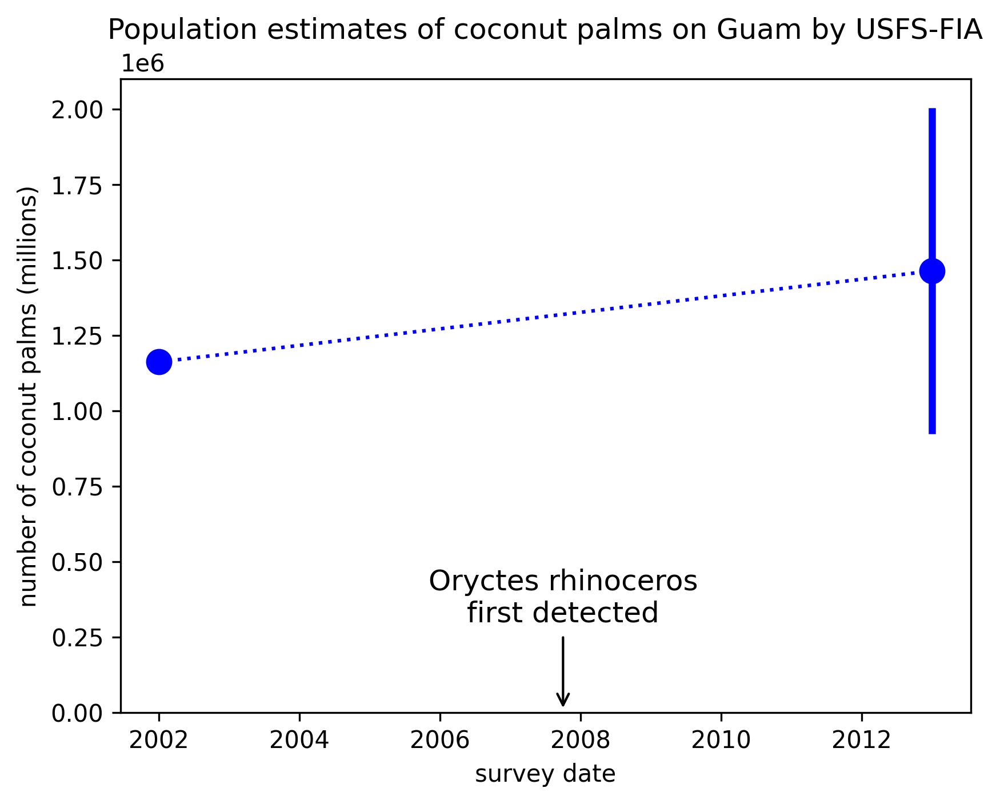

Figure 1. Island-wide population estimates for Guam estimated by the US Forest Service from Forest Inventory Assessment surveys performed in 2002 and 2013.
Note that different metrics were used in the two surveys.
The 2002 estimate comes from Donnegon et al. 2004, page 16, Table 5: Estimated number of live trees on forest land by species and diameter class. They reported a total of 1,162,494 live coconut palms growing on forest land on Guam during 2002.
The 2013 estimate comes from Lazaro et al. 2020, page 7, Tabel 2: Estimated number of trees on Guam, by species. They simply reported their estimate of the total number of coconut palms on Guam during 2013 as 1,464,000 with a sampling error of 528,000.

